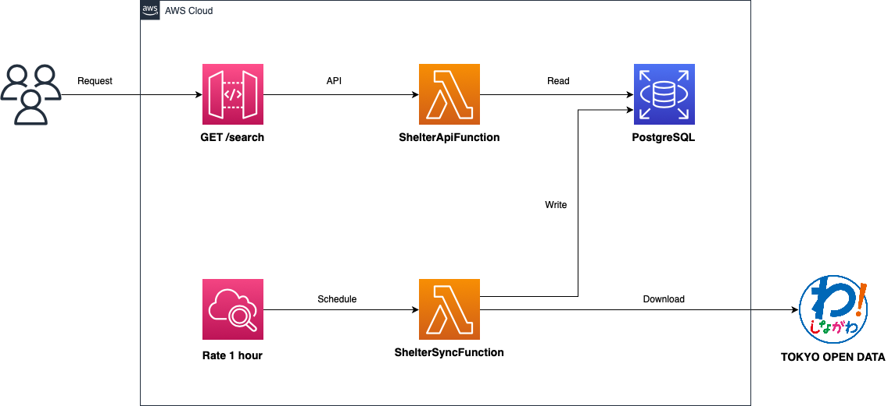

# Shinagawa Shelter
[](https://github.com/satoshiyamamoto/shinagawa-shelter/actions/workflows/deploy.yaml)

東京都品川区が公開する災害時等の避難所・広域避難場所を検索する Web API です。

## Usage

```bash
curl -X GET "${Endpoint}/search?lat=35.62061596793972&lon=139.70428920382872&page=1&size=5"
```

## Dataset

[東京都オープンデータ](https://portal.data.metro.tokyo.lg.jp)の公開データを利用しています。データセットは一時間間隔で同期されます。

###  品川区
* [災害時等の避難所・広域避難場所](https://catalog.data.metro.tokyo.lg.jp/dataset/t131091d0000000138)
* [一時集合場所](https://catalog.data.metro.tokyo.lg.jp/dataset/t131091d0000000002)

## Architecture

AWS サーバーレスアプリケーションモデルで構築されています。



## Web API

### Endpoint

https://wej40u1rfc.execute-api.ap-northeast-1.amazonaws.com/Prod/

### Resource

`GET` /search

### Description

指定された条件にマッチする避難所をリストで取得します。

### Parameters

Name | Type | Description
---- | ---- | -----------
`category` | string | 避難所のタイプ。デフォルトですべてのカテゴリを対象とします。 (避難所、一時集合場所、広域避難場所)
`lat` | double | 緯度。位置情報からの距離が近い順にソートする場合に指定します。
`lon` | double | 経度。位置情報からの距離が近い順にソートする場合に指定します。
`page` | number | ページ。デフォルトで1が指定されます。
`size` | number | ページあたりの件数。デフォルトで最大値が指定されます。

### Response

Status Code | Description
----------- | ------------
`200` | レスポンスが正常に出力された場合
`403` | リソースに権限がない場合
`500` | サーバーエラーが発生した場合
